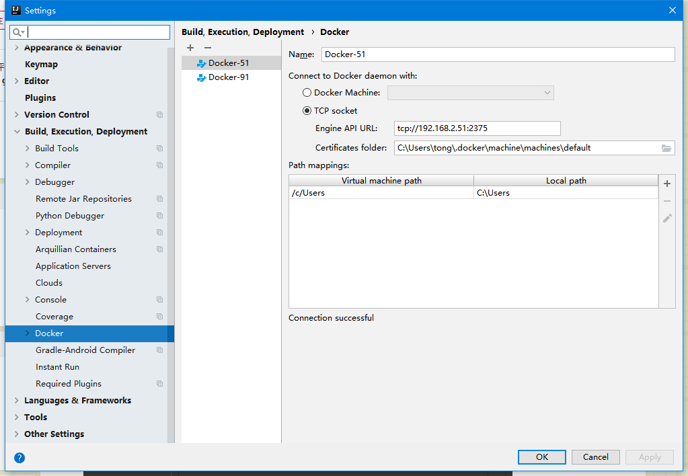
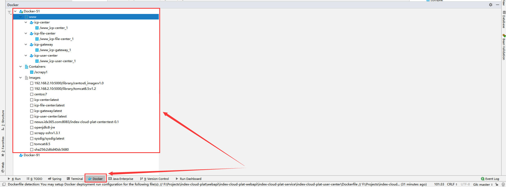

# IDEA 中 Docker 插件的使用

1. 打开idea的设置, 安装插件`Docker integration`.
2. 打开`File–>Settings–>Build,Execution,Deployment–>Docker`, 点击左上角的`+`, 填写右侧的`Engine API URL`, 点击OK退出. 如下图所示:

3. 点击idea低栏的docker图标:

可以看到里面展示了51服务器上的所有镜像和容器. 更多的操作可以自己多多尝试.