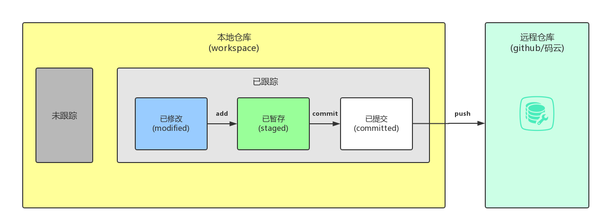
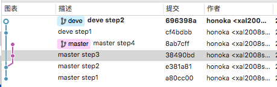
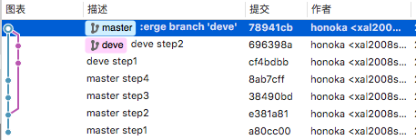
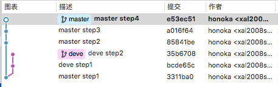
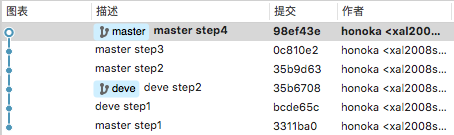

## git进阶

### git简介

git是一个分布式版本控制软件,最初由林纳斯·托瓦兹（Linus Torvalds）创作，于2005年以GPL发布.

    tips: git != github

### clone时 ssh 和 https 的区别

简单来讲:

+ https: 任何涉及到对远程仓库的修改都需要验证用户名和密码.
+ ssh: 添加公钥到服务器则可以实现免密修改.

具体还有更多细节的配置,可自行查阅.

### 文件的状态

+ 已修改(modified)
>表示修改了某个文件，但还没有提交保存

+ 已暂存(staged)
>表示把已修改的文件放在下次提交时要保存的清单中

+ 已提交(committed)
>表示该文件已经被安全地保存在本地数据库中了

### git 命令

+ git status
>查看本地仓库的状态 

+ git add 文件/文件夹/.
>跟踪文件,将文件的修改暂存

+ git diff
>查看尚未暂存的文件更新了哪些部分

+ git commit -m "提交日志"
>提交修改,存到本地仓库

+ git rm 文件
>删除工作区文件，并且将这次删除放入暂存区

预览将要删除的文件

    git rm -r -n --cached 文件/文件夹名称

停止追踪指定文件，但该文件会保留在工作区

    git rm -r --cached 文件/文件夹名称

+ git mv 旧文件名 新文件名
>文件重命名

+ git log
>查看文件提交历史

+ git commit --amend -m "提交信息"
>用来改写上一次commit的提交信息

+ git reset --hard 版本号
>回退到指定版本号

### 分支

#### 分支的意义

让项目在同一时间保持两种以上的状态,提高项目的稳定性.

#### 分支操作

新创建的仓库默认会有一个 master 分支.
值得注意的是:master分支和其他的任何分支没有任何不同!
只是我们常常把它当做"(像电视剧的剧情发展的)主线"而已.

**我们可以把分支理解为"平行世界".**

+ git branch 分支名称
>创建新的分支

+ git branch
>查看当前仓库中的分支

+ git branch -r
>查看远程分支

+ git branch -a
>查看所有分支

+ git checkout 分支名称
>切换分支

### merge 和 rebase :解决分支合并文件冲突的两种方案

*参考[闲谈 git merge 与 git rebase 的区别](http://www.jianshu.com/p/c17472d704a0)*

两种方案命令类似,下面以 merge 方法将 'dev' 分支合并到 'master':

1. 切换回master分支: `git checkout master`
2. 将test分支合并到master: `git merge dev`
3. (可选)删除test分支: `git branch -d dev`

#### merge

现在假设我们有一个主分支 master 及一个开发分支 dev，仓库历史就像这样：

如果我们开始`git merge dev`,
则git会把两个分支的最新提交即 8ab7cff 和 696398a 进行一个三方合并,
然后**将合并中修改的内容生成一个新的 commit**，即下图的 78941cb.

#### rebase

如果我们开始`git rebase dev`,
Git 会从两个分支的起点 3311ba0 开始提取 master 分支（当前所在分支）上的修改，即 85841be、a016f64 与 e53ec51，将这些修改预存起来当做"补丁".
然后master会"重复dev分支的每一次修改".处理完毕之后则把刚才预存的"master补丁"一个一个打上去.

结果如下图:

#### 总结

+ merge 是一个合并操作，会将两个分支的修改合并在一起，默认操作的情况下会提交合并中修改的内容.
+ merge 的提交历史忠实地记录了**在哪里**实际**发生过什么**.
+ rebase 并没有进行合并操作，只是将一个分支上的操作在另个一分支上重新做了一遍.
+ merge 与 rebase 都是非常强大的分支整合命令，没有优劣之分.