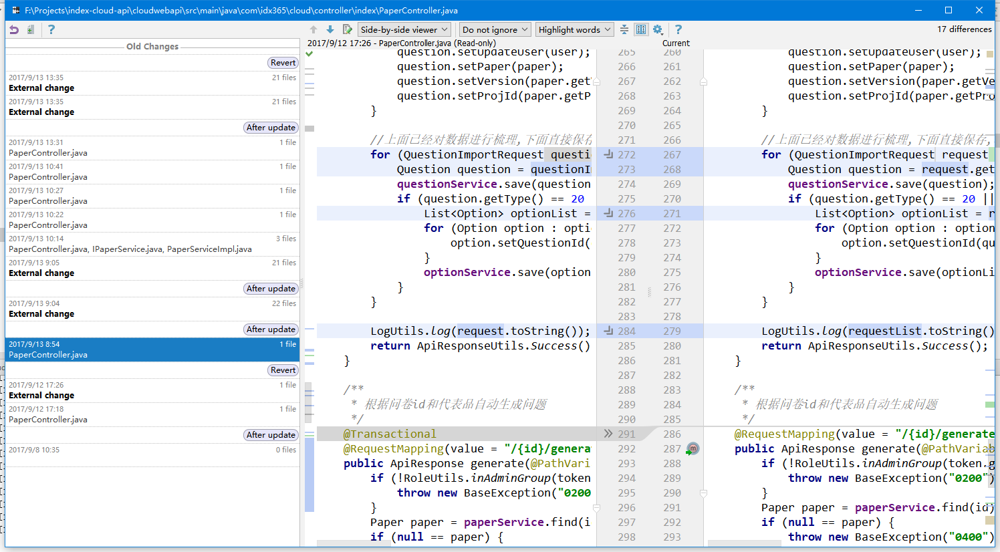

### IDEA使用技巧

#### 代码自动补全(tab键)

##### java

+ `thr --> throw new`
+ `fooList.for --> for(foo:fooList){}`
+ `/** --> /**...**/`
+ `sout --> System.out.println()`
+ `psvm --> Public static void main()`

##### html

+ `div. --> 

`
+ `div# --> 

`
+ `ul>li*6 --> <ul>...</ul>`

##### 自定义

`file --> settings --> Edit --> Live Template`

#### 常用快捷键

+ `Alt + Enter` 快速修复
+ `F2` 跳到下一个错误
+ `Ctrl + Alt + L` 格式化代码;
+ `Alt + Insert` 智能生成(getter,setter,toString...);
+ `Shift + F6` 快速改名
+ `Ctrl + F6` 快速修改方法参数
+ `Shift + Shift` 全局查找文件(匹配文件名)
+ `Ctrl + Shift + F` 全局搜索(匹配内容)
+ `Ctrl + Alt + T` 快速包裹(if,for,try...)
+ `Ctrl + W` 从内向外选中

##### 自定义格式化规则
     
`file --> settings --> Editor --> Code Style --> JavaScript`

#### Alt + Enter

`Alt + Enter`有多厉害?

+ 能帮助你解决99%的问题
+ 能消灭80%的代码错误
+ 提高编码水平,统一规范
+ 加快开发速度(快速创建对象...)

#### 插件
+ .ignore
+ Database Tools ans SQL
+ Markdown support
+ NodeJS
+ Python
+ Vue.js
+ Git

#### 其他

+ 如果可以,尽量选用Debug模式
+ 鼠标拖动来实现文件的快速剪切
+ 查看文件历史

+ Structure 工具 
+ todo 工具
+ VCS 工具
+ Maven Projects 工具
+ npm 工具