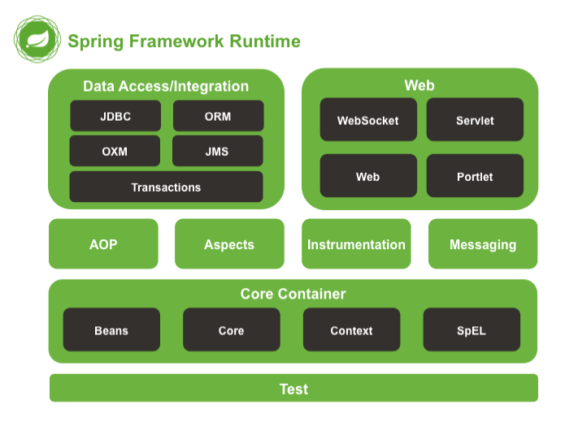

### Spring4.x

#### Spring能做什么？

#### Spring核心知识

+ Bean管理
+ IOC（DI）
+ AOP

> ##### Bean管理

    参见UserController、ProjectServiceImpl、IPaperDao。
    bean在容器中的名称，不能重复；
    bean的获取可以用“@Autowired”注解（还有“@Resource”）。
